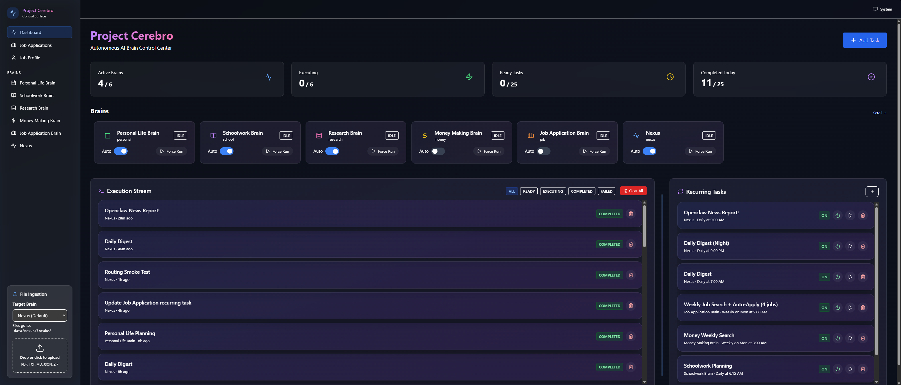

# Project Cerebro - Control Surface

A highly modular, agent-friendly **execution control surface** for running multiple OpenClaw “brains” (agents) with:
- an **Execution Stream** (source of truth)
- **Recurring Tasks** that spawn instances into the stream
- per-brain **Auto Mode** + manual Run
- channel-agnostic notifications via OpenClaw messaging

## What this is

Cerebro is a dashboard + runtime that helps you supervise a set of specialized agents (“brains”).

### Core model
- **Execution Stream = source of truth** for everything that will run / has run.
- **One-time tasks** execute when you click **Run** *or* when the brain is in **Auto Mode**.
- **Recurring tasks** spawn exactly one instance into the Execution Stream when due and execute regardless of Auto Mode.

### Brains
- A **brain** is a named scope + tool/context configuration bound to an OpenClaw agent id.
- **Nexus is the default brain**: general-purpose orchestration and “everything else.”

## Install / Setup (high level)

See **SETUP.md** for full instructions.

Quick outline:
1) Clone repo + install deps
2) Create `.env` from `.env.example` and set:
   - `OPENCLAW_GATEWAY_URL`
   - `OPENCLAW_TOKEN`
3) Copy templates:
   - `config/brains.template.json` → `config/brains.json`
   - `config/brain_targets.template.json` → `config/brain_targets.json`
4) (Optional) seed examples:
   - `npm run seed`

## Modularity (agent-friendly)

This repo is designed for agents to customize quickly:
- Add/remove brains by editing `config/brains.json` and `config/brain_targets.json`.
- Optional Job module: opt in/out by adding/removing the Job brain + pages (see `config/brains.jobs.addon.template.json`).
- Recurring tasks are templates under `config/seeds/`.

## Notes
- No secrets or personal IDs are committed; local config/DB are gitignored.
- Notifications are routed through OpenClaw’s channel system (Discord/Telegram/Signal/etc.).
